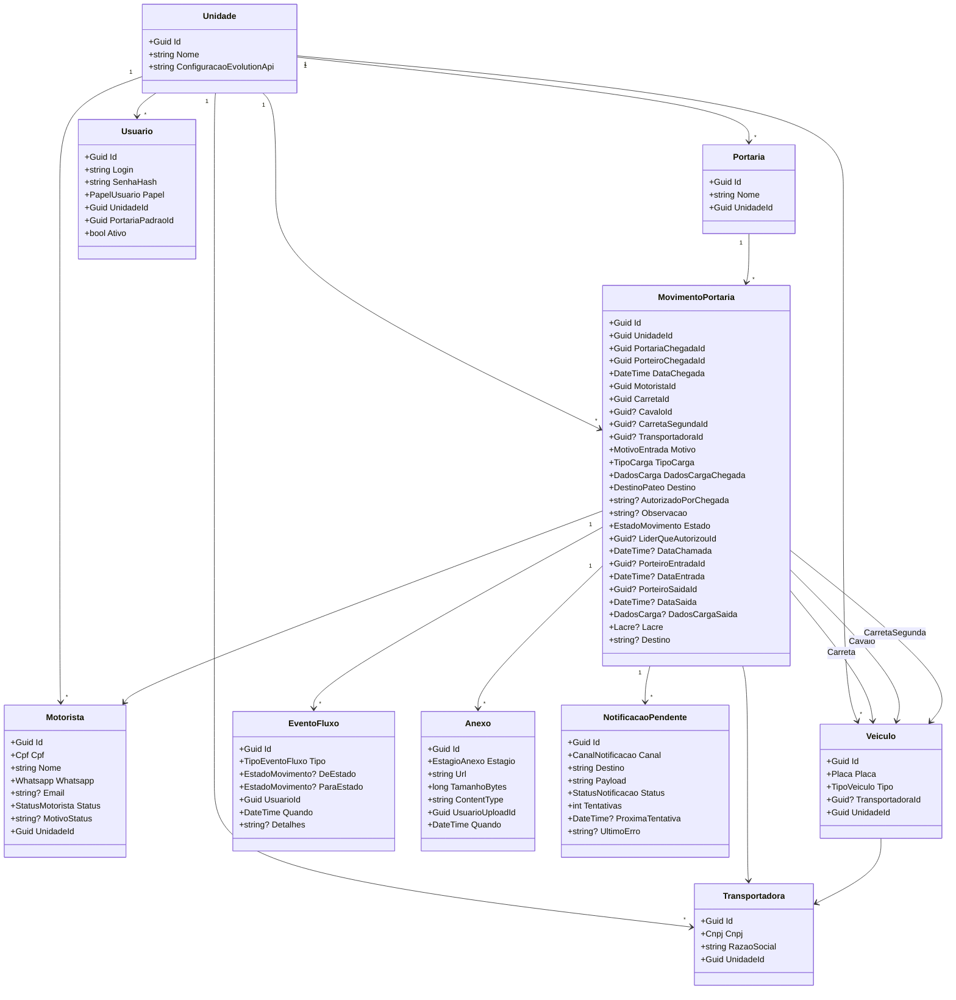

# 5. Modelagem do Dominio

## 5.1 Agregados raiz

| Agregado | Responsabilidade | Multi-tenant |
|----------|------------------|--------------|
| `Unidade` | Representa cada instalacao Frigoestrela (futuro: outros frigorificos). E o tenant. | raiz |
| `Portaria` | Cada portaria fisica de uma unidade. | filho de Unidade |
| `Usuario` | Login, papeis, vinculo com unidade e portaria padrao. | por Unidade |
| `Motorista` | Cadastro centralizado de motoristas (CPF, nome, WhatsApp, status, motivo bloqueio). | por Unidade |
| `Transportadora` | Cadastro de transportadoras (CNPJ, razao social). | por Unidade |
| `Veiculo` | Uma placa = um veiculo. Tipo: Cavalo, Carreta, CarretaSegunda. | por Unidade |
| `MovimentoPortaria` | Raiz do fluxo de chegada/pateo/saida. Composto por dados de chegada, dados de saida (condicional), eventos, anexos. | por Unidade + Portaria |

## 5.2 Entidades-filhas (parte do agregado MovimentoPortaria)

| Entidade | Pertence a | Descricao |
|----------|-----------|-----------|
| `EventoFluxo` | MovimentoPortaria | Registro imutavel de mudanca de estado ou edicao. Auditoria. |
| `Anexo` | MovimentoPortaria | Arquivo (foto/pdf) vinculado a um estagio do movimento. |
| `NotificacaoPendente` | MovimentoPortaria | Side-effect a ser entregue (WhatsApp, email, SignalR). Tem estado proprio: Pendente, Enviada, Falhou, Descartada. |

## 5.3 Value-objects

| VO | Composicao | Imutavel | Validacao |
|----|------------|----------|-----------|
| `Placa` | string normalizada (sem espacos/hifen, uppercase) | sim | regex Mercosul ou padrao antigo |
| `Lacre` | string | sim | nao vazio (preenchido apenas em saida de Carga) |
| `DadosCarga` | { NumeroNF?, Produto?, Setor?, Contrato?, NumeroContainer? } | sim | preenchido na chegada e na saida (campos diferentes em cada) |
| `Cpf` | string normalizada | sim | algoritmo de validacao de CPF |
| `Cnpj` | string normalizada | sim | algoritmo de CNPJ |
| `Whatsapp` | string E.164 | sim | regex E.164 |

## 5.4 Enums

```
StatusMotorista        : Ativo, Pendente, Bloqueado
PapelUsuario           : Porteiro, Lider, Supervisor, Admin
TipoVeiculo            : Cavalo, Carreta, CarretaSegunda
MotivoEntrada          : Carga, Descarga, Devolucao, Outro
TipoCarga              : Frigorificada, Seca, Container, Lavador, Outro
DestinoPateo           : Interno, Externo, Lavador
EstadoMovimento        : NoPateoExterno, ChamadoParaInterno, NoPateoInterno, NoLavador, Saiu, Cancelado, Desistencia
EstagioAnexo           : Chegada, Entrada, Saida
TipoEventoFluxo        : ChegadaRegistrada, AlertaBloqueio, ChamadaAutorizada, ChamadaExpirada,
                          EntradaConfirmada, SaidaRegistrada, Cancelamento, Desistencia, EdicaoCampo
CanalNotificacao       : Whatsapp, Email, Socket
StatusNotificacao      : Pendente, Enviada, Falhou, Descartada
```

## 5.5 Maquina de estados de MovimentoPortaria

```
[start]
   |
   v
DestinoPateo=Externo:  NoPateoExterno  --(CDU-004 ChamarVeiculo)-->  ChamadoParaInterno
                                                                           |
                                                       (CDU-006 ConfirmarEntrada)
                                                                           v
                                                                  NoPateoInterno  --(CDU-007 RegistrarSaida)--> Saiu

DestinoPateo=Interno:  NoPateoInterno  --(CDU-007 RegistrarSaida)--> Saiu

DestinoPateo=Lavador:  NoLavador  --(transicao manual)-->  NoPateoInterno  --(CDU-007)--> Saiu

ChamadoParaInterno  --(TTL 30min expirado, CDU-005)--> NoPateoExterno (com EventoFluxo: ChamadaExpirada)

Em qualquer estado != Saiu:
   --(CDU-008)--> Cancelado
   --(CDU-009)--> Desistencia
```

Estados terminais: `Saiu`, `Cancelado`, `Desistencia`.

## 5.6 Diagrama de classes



## 5.7 Decisoes de modelagem (justificativa)

### Veiculo individual por placa (vs composicao fixa)
Cada placa (`Cavalo`, `Carreta`, `CarretaSegunda`) e um `Veiculo` autonomo com historico proprio. Razao: a composicao do conjunto muda entre viagens (uma carreta pode trocar de cavalo); o que importa para auto-fill e o historico **da placa**, nao do conjunto. `MovimentoPortaria` referencia ate 3 veiculos por papel (Carreta obrigatoria, Cavalo e CarretaSegunda opcionais).

### MovimentoPortaria como agregado raiz unico do fluxo
Em vez de modelar `Chegada`, `Saida`, `Chamada` como entidades separadas, todo o ciclo de vida do veiculo na unidade e **um agregado**. Razoes: invariantes da maquina de estados ficam encapsulados num so lugar; auditoria em `EventoFluxo` filho fica trivial; consultas tipicas ("o que aconteceu com a placa X hoje") sao em uma unica raiz.

### EventoFluxo imutavel (event sourcing leve)
Toda mudanca de estado e edicao gera um `EventoFluxo`. O estado atual de `MovimentoPortaria` e canonico (snapshot), mas o historico e reconstrutivel. Isso atende LGPD/auditoria sem custo de event sourcing puro.

### NotificacaoPendente fora da camada de aplicacao sincrona
Notificacoes sao side-effects que nao podem bloquear logica de negocio. `NotificacaoPendente` e persistida com a mudanca de estado (mesma transacao do `EventoFluxo`), e um worker BackgroundService processa retry.

### DadosCarga value-object com campos opcionais
`DadosCarga` agrupa `NumeroNF`, `Produto`, `Setor`, `Contrato`, `NumeroContainer`. Campos diferentes obrigatorios em chegada vs saida. Validacao por contexto (sao 2 atributos no `MovimentoPortaria`: `DadosCargaChegada` e `DadosCargaSaida`). Razao: evitar polluir tabela `MovimentoPortaria` com 10 colunas null.

### Multi-tenant por coluna `UnidadeId`
Solucao mais simples para o estagio atual (uma unidade) e que ja prepara para multi-empresa (varias unidades). Toda query filtra `UnidadeId` via `IUnidadeContext` injetado. Sem schema-per-tenant ate ter justificativa de volume.

### Sem heranca em Pessoa
`Motorista` e `Usuario` tem dados similares (nome, contato), mas ciclos de vida e regras totalmente diferentes (motorista vem de fora; usuario e funcionario interno). Usar value-object `DadosContato` se ficar redundante. Heranca aqui seria over-engineering.

### Lock otimista em MovimentoPortaria
Para evitar dois lideres chamando o mesmo veiculo, EF Core usa `[Timestamp]`/`[ConcurrencyCheck]` em `MovimentoPortaria.Estado`. Conflitos retornam erro de dominio claro `MovimentoJaLiberado`.
